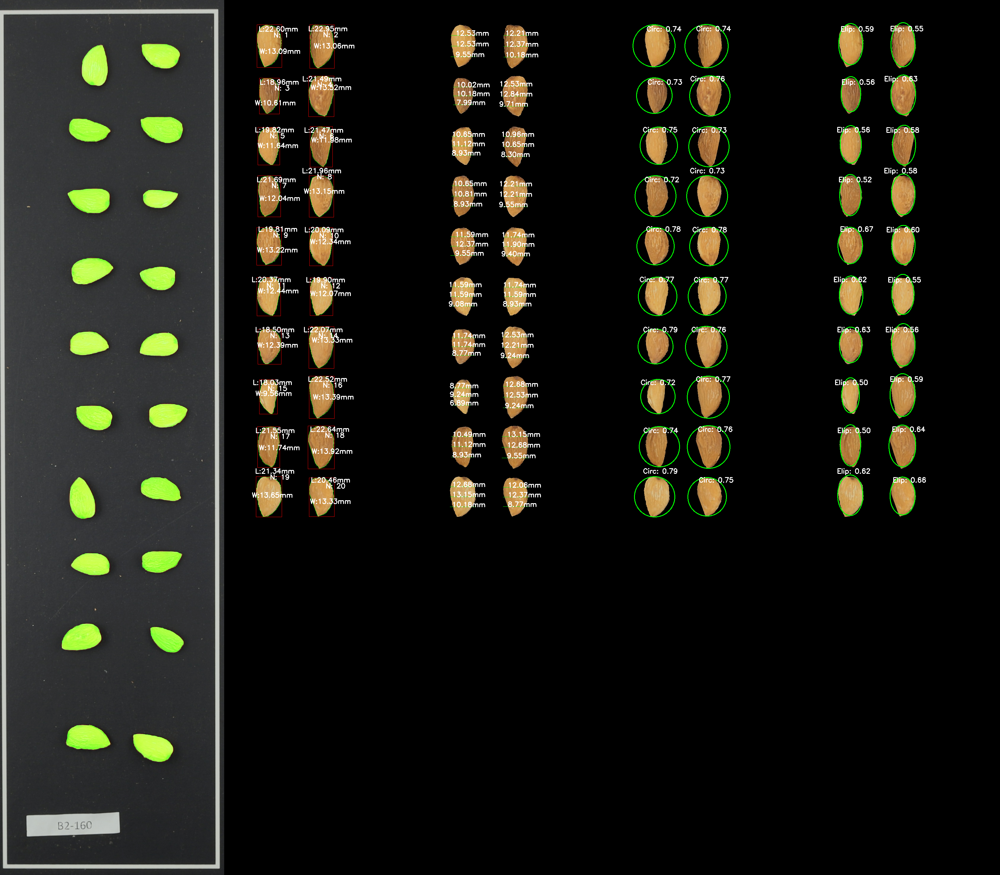
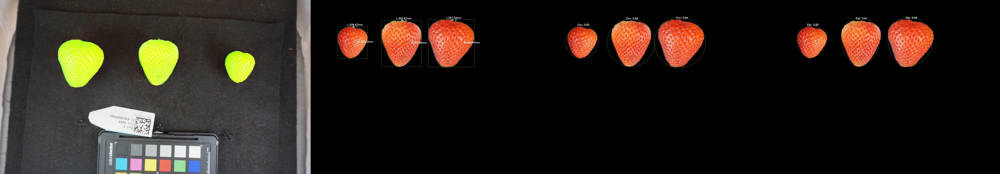
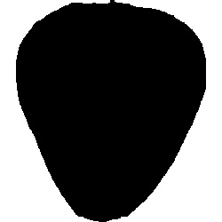
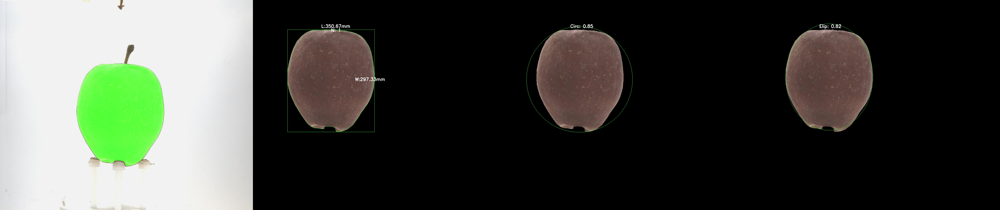
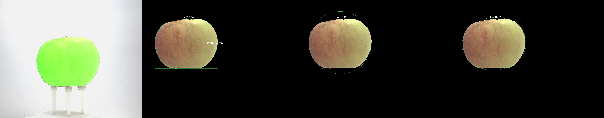

# Open RGB Imaging Workflow for Morphological and Morphometric Analysis


## Overview

This repository provides an open-source implementation of the RGB imaging workflow for morphological and morphometric analysis of fruits and seeds.

*Open RGB Imaging Workflow for Morphological and Morphometric Analysis of Fruits and Seeds using AI: A Case Study on Almonds.*

Fruit Breeding Group, Department of Plant Breeding, Centro de Edafología y Biología Aplicada del Segura - Spanish Research Council (CEBAS-CSIC), Campus Universitario Espinardo, E-30100 Murcia, Spain.

## Features

- Open-source RGB imaging workflow.
- AI-based morphological and morphometric analysis.
- Automated image processing for fruit and seed characterization.
- Reproducible methodology for research applications.

## Installation

To use this workflow, you can either clone the repository to work locally or access it online via Google Colab.

### Clone for local use:

```sh
git clone https://github.com/jorgemasgomez/almondcv2
cd your-repository-name
pip install -r requirements.txt
```

### Work online in Google Colab:


[](https://colab.research.google.com/github/jorgemasgomez/almondcv2/blob/main/Workflow_complete_Google_Colab.ipynb)


### Install dependencies with:

```sh
pip install -r requirements.txt
```


## Example Images

### Almond processed by the workflow

Mas-Gómez, J., Rubio, M., Dicenta, F., & Martínez-García, P. J. 2025. *Open RGB Imaging Workflow for Morphological and Morphometric Analysis of Fruits using AI: A Case Study on Almonds.*

<p align="center">
  
</p>

### Strawberry processed by the workflow

Mitchell J Feldmann, Michael A Hardigan, Randi A Famula, Cindy M López, Amy Tabb, Glenn S Cole, Steven J Knapp, Multi-dimensional machine learning approaches for fruit shape phenotyping in strawberry, GigaScience, Volume 9, Issue 5, May 2020, giaa030, https://doi.org/10.1093/gigascience/giaa030


<p align="center">
  
</p>

<p align="center">
  
</p>

### Apple processed by the workflow

Beat Keller, Michaela Jung, Simone Bühlmann-Schütz, Marius Hodel, Bruno Studer, Giovanni A L Broggini, Andrea Patocchi, The genetic basis of apple shape and size unraveled by digital phenotyping, G3 Genes|Genomes|Genetics, Volume 14, Issue 5, May 2024, jkae045, https://doi.org/10.1093/g3journal/jkae045

<p align="center">
  
</p>

<p align="center">
  
</p>


## Citation

If you use this workflow in your research, please cite:

Mas-Gómez, J., Rubio, M., Dicenta, F., & Martínez-García, P. J. 2025. *Open RGB Imaging Workflow for Morphological and Morphometric Analysis of Fruits using AI: A Case Study on Almonds.*

## License

This project is licensed under the MIT License.


